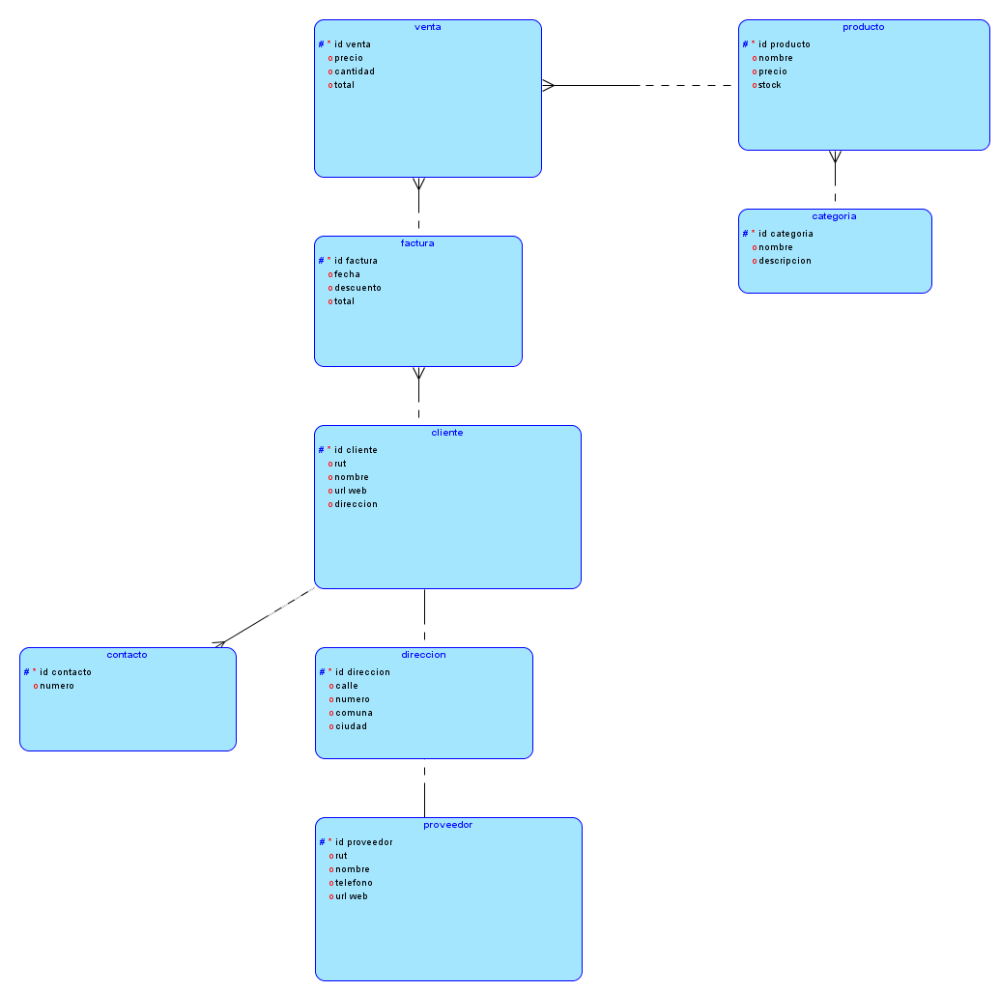

# Practica #2
## Enunciado 1
* Esquema conceptual
  
    

* Esquema Logico
  
    
    
## Enunciado 2
* Esquema conceptual
  
    

* Esquema Logico
  
    
    
## Enunciado 3
* Esquema conceptual
  
    

* Esquema Logico
  
    

## Enunciado 4
* Esquema conceptual
  
    

* Esquema Logico
  
    
 
 
