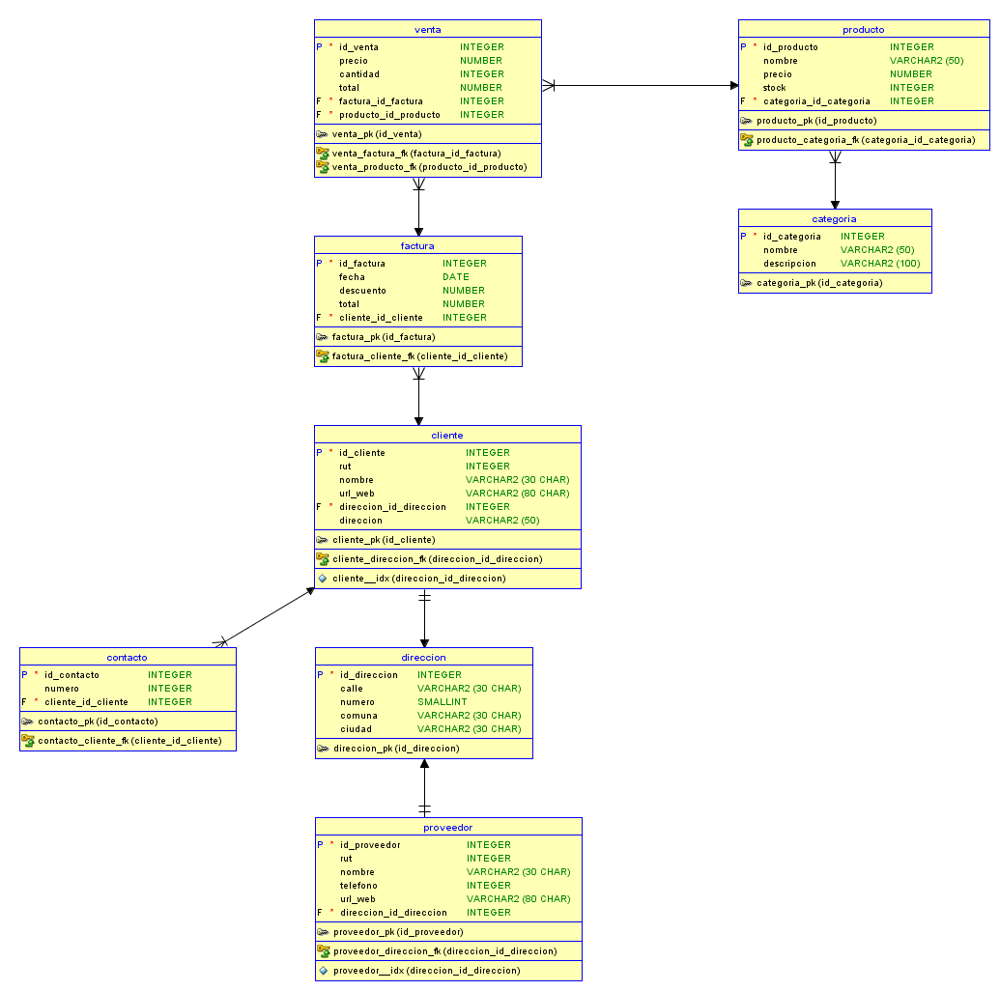

# Practica #2

## Descripción del sistema
* **Requerimientos de data modeler:**
  * **SO:** Microsoft Windows 7 / 8 / 10
  * **Procesador:** Quad core 2.4GHz
  * **Memoria:** 1 GB de RAM
  * **Gráficos:** NVidia GTX 360 ó Radeon HD 5970
  * **Almacenamiento:** 2 GB de espacio disponible

* **Sistema desarollado:**
  * **Procesador:** Intel Core i7 8th, 3.10 GHZ
  * **SO:** Windows 10 pro
  * **Arquitectura:** 64 bits
  * **Memoria:** 12 GB de RAM
  * **Graficos:** NVIDIA GEFORCE 1050 GTX

## Enunciado 1
* Esquema conceptual
  
    

* Esquema Logico
  
    
    
## Enunciado 2
* Esquema conceptual
  
    

* Esquema Logico
  
    
    
## Enunciado 3
* Esquema conceptual
  
    

* Esquema Logico
  
    

## Enunciado 4
* Esquema conceptual
  
    

* Esquema Logico
  
    
 
 
